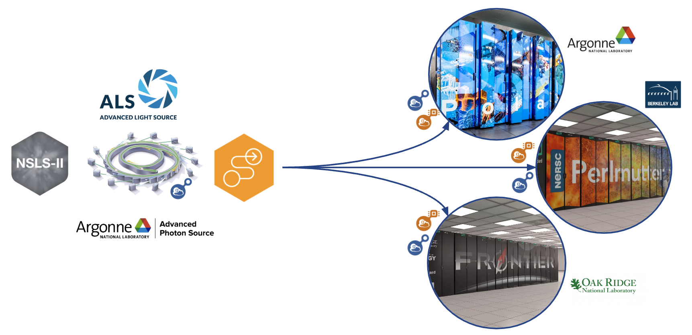

# Tomography Flow Example



This repository demonstrates how [Tomopy](https://tomopy.readthedocs.io/en/latest/) reconstructions can be automated using [Globus Flows](https://www.globus.org/globus-flows-service). The notebook aims to show how an individual flow can be used to integrate different light sources and compute facilities.

## Configuring a compute environment

We use [Globus Compute](https://globus-compute.readthedocs.io/en/latest/index.html) to perform Tomopy remotely. To plug your own Compute endpoint in you will need to install globus-compute-endpoint and the tomopy dependencies listed in compute-requirements.txt


## Repository Structure

tomography_flow/ 
├── recipes/ 
│ └── Dockerfile # OCI recipe for building the container image 
├── tomo_flow/ # Package containing the tomo_flow module (with recon.py, etc.)
│ └── recon.py
│ └── run_tomopy.py # Script to run the tomographic reconstruction workflow 
├── notebooks/
├── imgs/
└── README.md # This file

## Prerequisites


## Building the Container Image

1. **Clone the Repository:**
   ```bash
   git clone https://github.com/ravescovi/tomography_flow.git
   cd tomography_flow
   ```

## Running the container

```bash
podman run -it --rm \
  -v "/home/ravescovi/Downloads/NSLS2":/data \
  -v "/home/ravescovi/workspace/tomography_flow":/app \
  tomography_flow:latest python3 /app/tomo_flow/run_tomopy.py \
    --proj-file /data/scan_00244/proj_00000.hdf \
    --angles-file /data/scan_00244/scan_00244.nxs \
    --dark-file /data/scan_00245/dark_00000.hdf \
    --flat-file /data/scan_00245/flat_00000.hdf \
    --recon-init 1000 \
    --recon-end 1010 \
    --output-dir /data/scan_00244/recon_output \
    --show-images
    ```